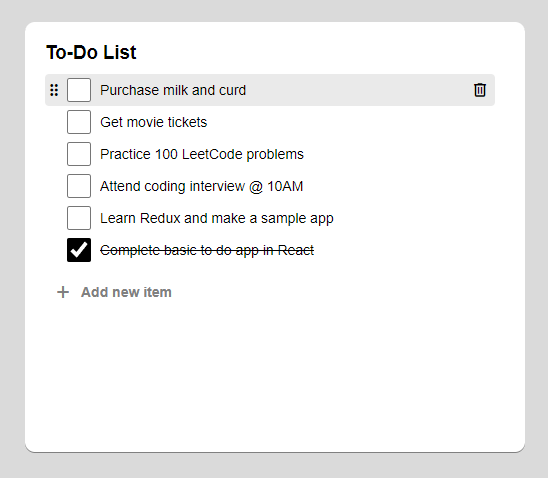

# todo-react

A simple to-do application created using React 18.

**App #1 - This application is part of my React learning journey.**

## Features

1. Add/edit/delete to-do item
2. Mark as done
3. Drag-and-drop
4. Move completed to bottom
5. Add new item on pressing Enter key
6. Multi-line to-do item
7. Rich-text (Bold, Italic & Underline)
8. Responsive design (upcoming)

## Notes

This application is made as a part of my React learning journey and it covers the following concepts:

1.  React app code-base creation
2.  Basic component structure
3.  `useState()` and `useEffect()` hooks
4.  Using Props in React components
5.  Utilising local storage for saving data
6.  Custom CSS design
7.  Using custom components
8.  `createRef()` to create arbitrary references

## Pre-requisites

This application uses Yarn package manager. So first you'll have to install Yarn for a smoother experience.

To install Yarn use the following command:

    $ npm i -g yarn

Once Yarn is installed, install the dependencies for this application:

    $ yarn install

## How to run?

To run this application, use the following command:

    $ yarn start
